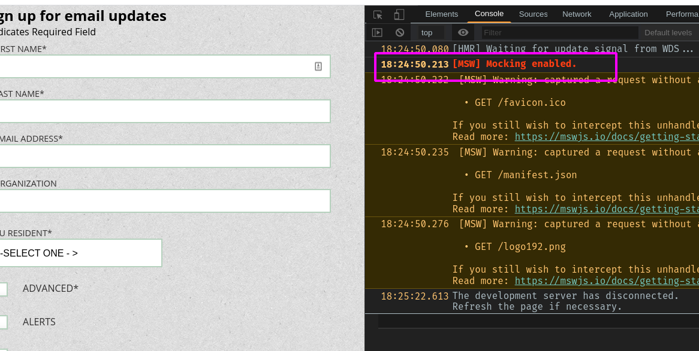
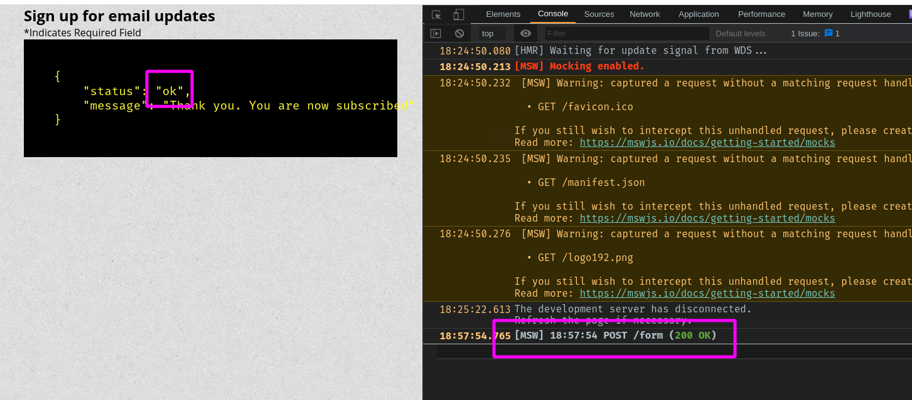
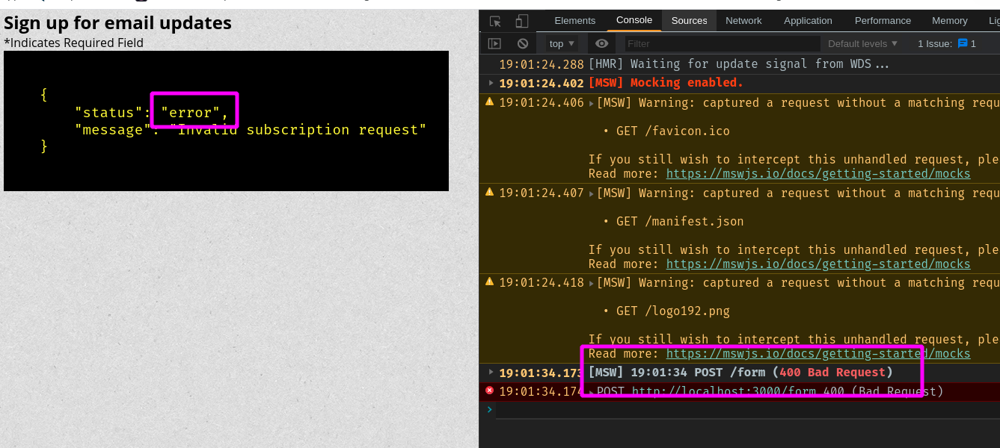

# Work in progress

## Features:

- Layout
- State Management
- Frontend validation
- Mock Server Response

### Layout

The project was build based on `create-react-app` package  
React code was written in `Typescript`  
Styling code uses `.SCSS` files
Two viewport supported mobile < 768px and desktop > 768px

## State Management

Used `useReducer` [React Hook](https://reactjs.org/docs/hooks-reference.html#usereducer)

## Frontend Validation

Custom Validation uses [specif functions](src/utils/validation.ts)

## Mock Server Response

For mocking server I implemented [Mock Service Worker](https://mswjs.io/)
The server is a Service Worker that intercepts http requests
and respond with the pre-made response
After installing and configuring worker server, in console it'll show the
mock service is on
When running the app (dev server):

```bash
npm run start
```

On browser console you'll see:


Then fill in required form fields and hit _submit_ button

The response from server will be shown instead of Form.  
In order to handle response OK and response Error  
in server logic stablish a random number generator that roughly render  
50% success and 50% error responses

```typescript
export const handlers = [
  rest.post<FormBody, HandlerResponse>("/form", (req, res, ctx) => {
    let json: HandlerResponse;
    if (Math.random() > 0.5) {
      json = { status: "ok", message: "Thank you. You are now subscribed" };
      return res(ctx.json(json));
    } else {
      json = { status: "error", message: "Invalid subscription request" };
      return res(ctx.status(400), ctx.json(json));
    }
  }),
];
```

success:

error:


## Screenshots

videos  
[layout-responsive-validation](https://drive.google.com/file/d/1c6OkwniQEQ7B4UECuJyF2bD0pYm5Ja-A/view?usp=sharing)  
[mocked-server-response](https://drive.google.com/file/d/1ILtYzFdG83nki5RgM12baMnxd200olbB/view?usp=sharing)
